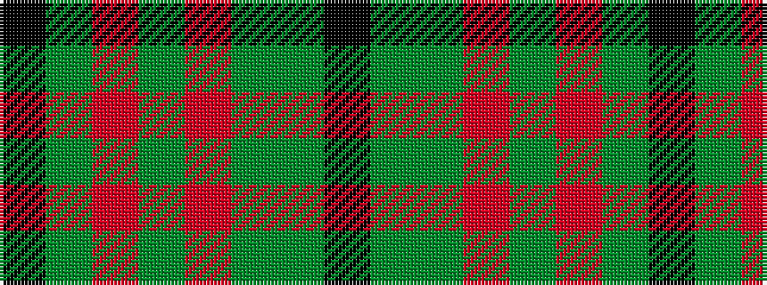

KGGRGRGK

It is a 8 stripe tartan.

<figure class="pat-woven">

<figcaption>idealised sample</figcaption>
</figure>

## Colour Sequence



## Tartans with this colour sequence

| Tartans |
|---------------|
| [Earle's Flame](/setts/s8/k10y24r3y3r24dg3y6k6~x2/)|
||
