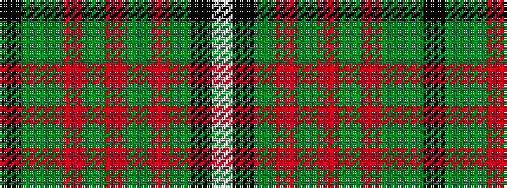

KGGRGRGRGKW

It is a 11 stripe tartan.

<figure class="pat-woven">

<figcaption>idealised sample</figcaption>
</figure>

## Colour Sequence



## Tartans with this colour sequence

| Tartans |
|---------------|
| [Elwyn Glen (Scottish Borders)](/variants/s11/k2y10g4o5g2o3g2o5g4k15lb2~x2/)|
||
