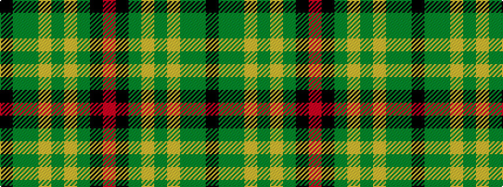

KGGYGYGKR

It is a 9 stripe tartan.

<figure class="pat-woven">

<figcaption>idealised sample</figcaption>
</figure>

## Colour Sequence



## Tartans with this colour sequence

| Tartans |
|---------------|
| [Broons, The (DC Thomson)](/variants/s9/r3k1yi8ly1dy7ly1yi19y25k1~x2/)|
||
| [The Broons (Corporate)](/variants/s9/r3k1y8lo1dyi7lo1y19dy25k1~x2/)|
||
