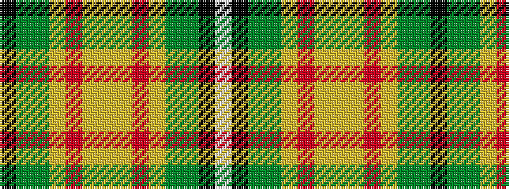

KGGYRYYYRYGGKW

It is a 14 stripe tartan.

<figure class="pat-woven">

<figcaption>idealised sample</figcaption>
</figure>

## Colour Sequence



## Tartans with this colour sequence

| Tartans |
|---------------|
| [Saskatchewan](/variants/s14/w2k1g6dy11lo26r2lo1ly2~x2/)|
||
