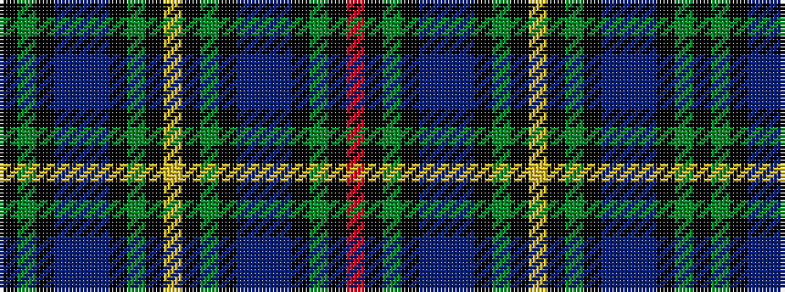

KGKBBBKGKYKGKBBBKGKR

It is a 20 stripe tartan.

<figure class="pat-woven">

<figcaption>idealised sample</figcaption>
</figure>

## Colour Sequence



## Tartans with this colour sequence

| Tartans |
|---------------|
| [Smith](/setts/s20/r2k1g7k6db7b2db7k6g7k1lo2~x4/)|
||
