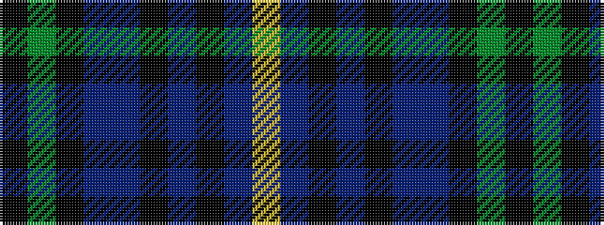

KGKBBKBKBY

It is a 10 stripe tartan.

<figure class="pat-woven">

<figcaption>idealised sample</figcaption>
</figure>

## Colour Sequence



## Tartans with this colour sequence

| Tartans |
|---------------|
| [Dinwiddie Hunting](/variants/s10/ly6db3k3db36k10n18db6k2g4k3~x2/)|
||
