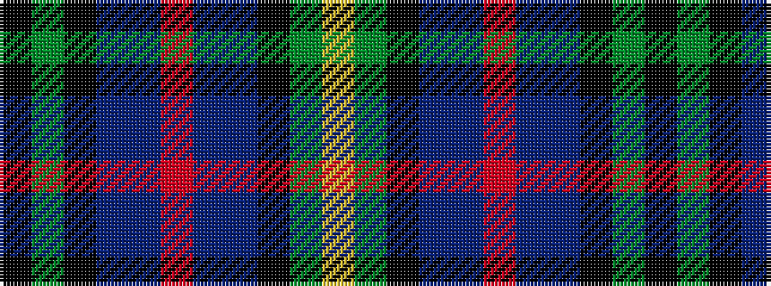

KGKBBRBBKGY

It is a 11 stripe tartan.

<figure class="pat-woven">

<figcaption>idealised sample</figcaption>
</figure>

## Colour Sequence



## Tartans with this colour sequence

| Tartans |
|---------------|
| [Loch Lomond Millenium](/variants/s11/k3dg2k12db4b19r3b19db4k12dg2lo3~x2/)|
||
| [Loch Lomond Millennium](/variants/s11/k3g2k12dt4db19r3db19dt4k12g2ly3~x2/)|
||
