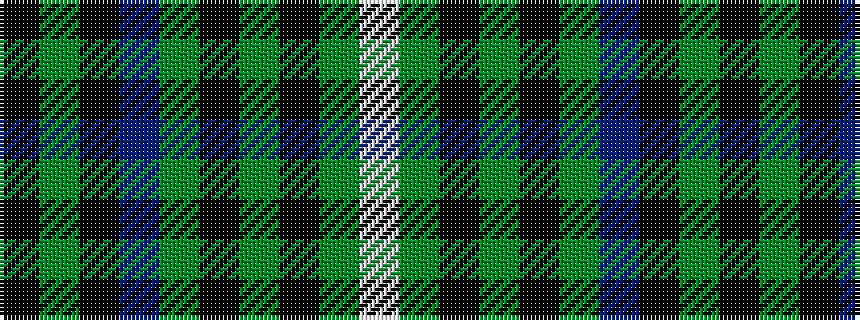

KGKBGKGKGW

It is a 10 stripe tartan.

<figure class="pat-woven">

<figcaption>idealised sample</figcaption>
</figure>

## Colour Sequence



## Tartans with this colour sequence

| Tartans |
|---------------|
| [O'Connell, William Benedict (Personal)](/variants/s10/k19dg7k7t2dg20ki9dg6ki4dg10w3~x2/)|
||
