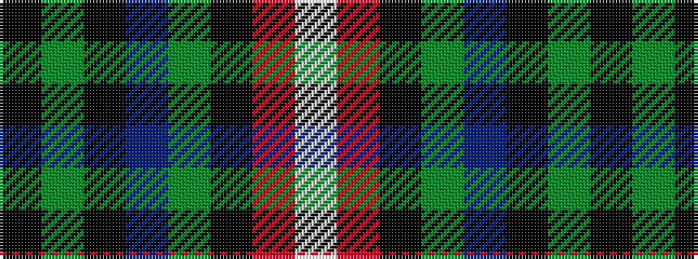

KGKBGKRW

It is a 8 stripe tartan.

<figure class="pat-woven">

<figcaption>idealised sample</figcaption>
</figure>

## Colour Sequence



## Tartans with this colour sequence

| Tartans |
|---------------|
| [YPO Dress](/setts/s8/k3y16k2dp12dg12k2o16lb3~x2/)|
||
