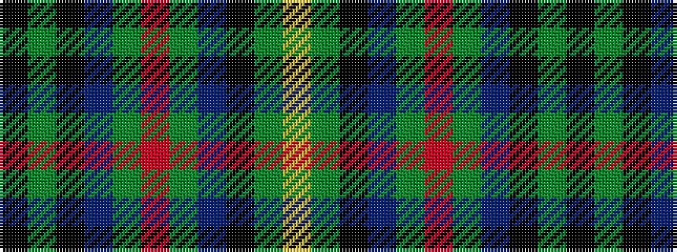

KGKBGRGBKGY

It is a 11 stripe tartan.

<figure class="pat-woven">

<figcaption>idealised sample</figcaption>
</figure>

## Colour Sequence



## Tartans with this colour sequence

| Tartans |
|---------------|
| [Loch Lomond Millenium Comemmorative Tartan](/variants/s11/k3gi2k12db4g19r3g19db4k12gi2ly3~x2/)|
||
