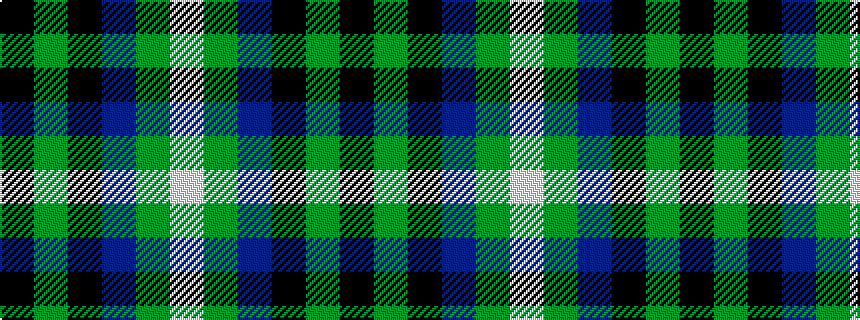

KGKBGW

It is a 6 stripe tartan.

<figure class="pat-woven">

<figcaption>idealised sample</figcaption>
</figure>

## Colour Sequence



## Tartans with this colour sequence

| Tartans |
|---------------|
| [Longmuir (2014)](/variants/s6/k43dg8k8dt21dg10w2~x2/)|
||
