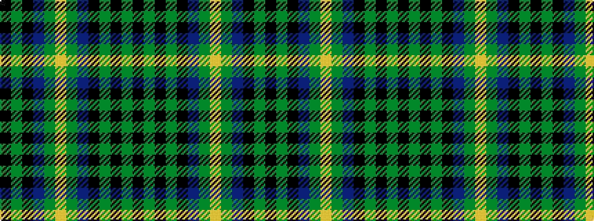

KGKBGYGBKGKGK

It is a 13 stripe tartan.

<figure class="pat-woven">

<figcaption>idealised sample</figcaption>
</figure>

## Colour Sequence



## Tartans with this colour sequence

| Tartans |
|---------------|
| [Sawicki, Peter (Personal)](/variants/s13/k20g4k4db4g28lo1g28db4k20g8k4g4k4~x2/)|
||
| [Sawicki, Peter (Personal)](/variants/s13/k10g2k2db2g14lo1g14db2k10g4k2g2k2~x2/)|
||
