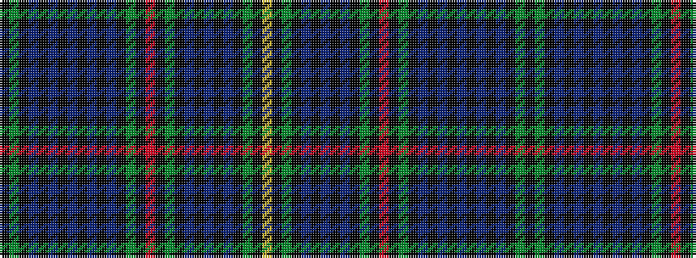

KGKBKBKBKBKBKGKRKGKBKBKBKGKY

It is a 28 stripe tartan.

<figure class="pat-woven">

<figcaption>idealised sample</figcaption>
</figure>

## Colour Sequence



## Tartans with this colour sequence

| Tartans |
|---------------|
| [MacEwen (Clans Originaux)](/setts/s28/k1g6k6db1k1db1k1db7k1db1k1db1k6g6k1r1k1g6k6db6k1db1k1db6k6g6k1ly1~x4/)|
||
