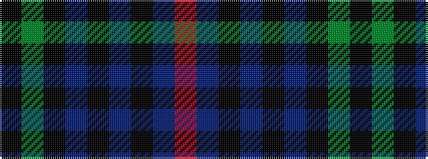

KGKBKBKBR

It is a 9 stripe tartan.

<figure class="pat-woven">

<figcaption>idealised sample</figcaption>
</figure>

## Colour Sequence



## Tartans with this colour sequence

| Tartans |
|---------------|
| [Urquhart - 1810 ((Clan)](/setts/s9/r9db11k3db3k3db3k20g20k3~x2/)|
||
| [Urquhart D](/setts/s9/r3db6k1db1k1db1k6dg9k2~x2/)|
||
