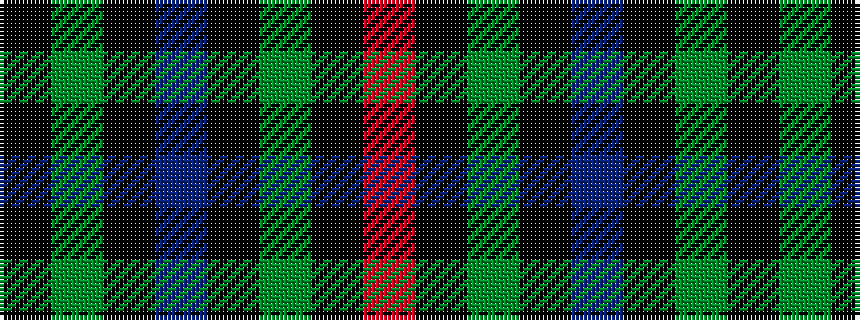

KGKBKGKR

It is a 8 stripe tartan.

<figure class="pat-woven">

<figcaption>idealised sample</figcaption>
</figure>

## Colour Sequence



## Tartans with this colour sequence

| Tartans |
|---------------|
| [Clark, Red](/setts/s8/db13k4y4k4r13~x4/)|
||
