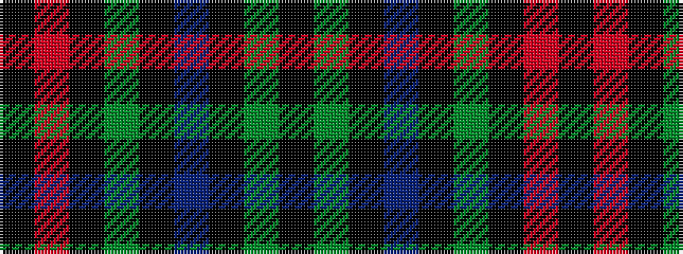

KGKBKGKRK

It is a 9 stripe tartan.

<figure class="pat-woven">

<figcaption>idealised sample</figcaption>
</figure>

## Colour Sequence



## Tartans with this colour sequence

| Tartans |
|---------------|
| [Scotland's Lionheart](/setts/s9/k78y16k2n2k2y2k3r2k10~x2/)|
||
