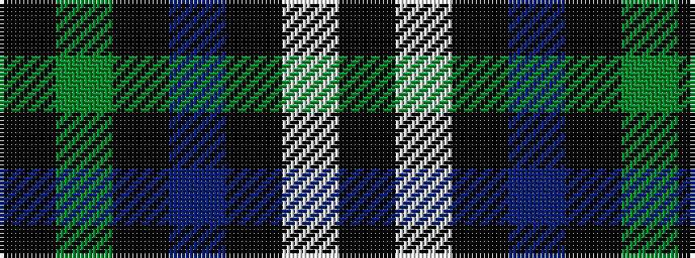

KGKBKWK

It is a 7 stripe tartan.

<figure class="pat-woven">

<figcaption>idealised sample</figcaption>
</figure>

## Colour Sequence



## Tartans with this colour sequence

| Tartans |
|---------------|
| [Frame (Edinburgh) (Personal)](/setts/s7/k16g15k4t12k22w2k6~x2/)|
||
