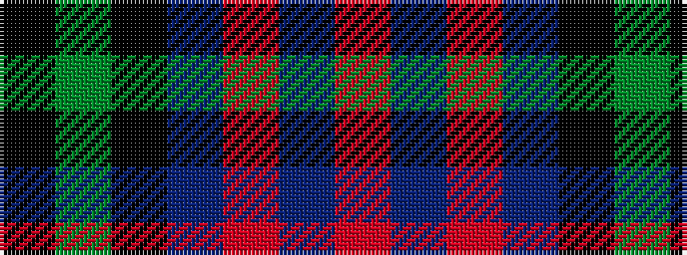

KGKBRBR

It is a 7 stripe tartan.

<figure class="pat-woven">

<figcaption>idealised sample</figcaption>
</figure>

## Colour Sequence



## Tartans with this colour sequence

| Tartans |
|---------------|
| [National Galleries of Scotland](/setts/s7/k7g22k22db6r2db15r2~x2/)|
||
