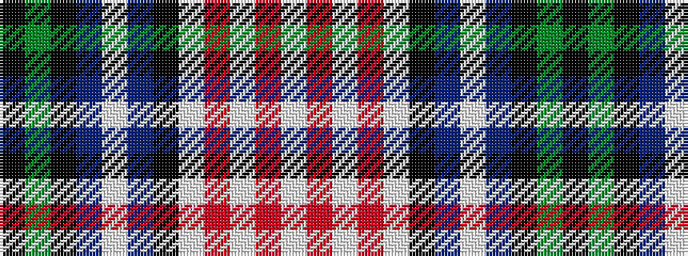

KGKBWBKWRWRW

It is a 12 stripe tartan.

<figure class="pat-woven">

<figcaption>idealised sample</figcaption>
</figure>

## Colour Sequence



## Tartans with this colour sequence

| Tartans |
|---------------|
| [Forbes - 1970 (WCWM #1)](/setts/s12/k6g5k6do6w1do10k6w3r1w12r1w3~x4/)|
||
