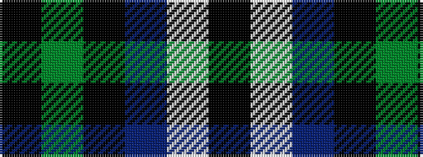

KGKBWK

It is a 6 stripe tartan.

<figure class="pat-woven">

<figcaption>idealised sample</figcaption>
</figure>

## Colour Sequence



## Tartans with this colour sequence

| Tartans |
|---------------|
| [Loch Leven, Check](/setts/s6/k2g13k11t4w9k2~x2/)|
||
