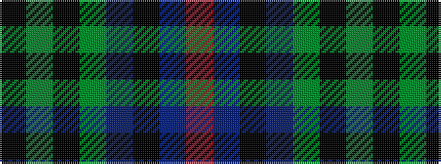

KGKGBKBR

It is a 8 stripe tartan.

<figure class="pat-woven">

<figcaption>idealised sample</figcaption>
</figure>

## Colour Sequence



## Tartans with this colour sequence

| Tartans |
|---------------|
| [Brave for Men (Fashion)](/setts/s8/k5dy5k5dy34n33k6n5o2/)|
||
