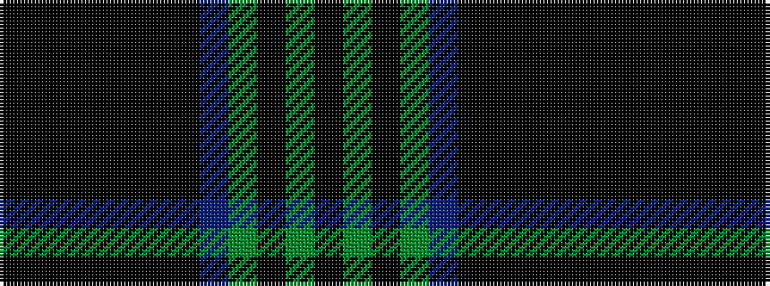

KGKGBKKKKKKK

It is a 12 stripe tartan.

<figure class="pat-woven">

<figcaption>idealised sample</figcaption>
</figure>

## Colour Sequence



## Tartans with this colour sequence

| Tartans |
|---------------|
| [Daks (Chino Check)](/variants/s12/k22k3ki7k2ki2k2ki2db10y6ki2y3k2~x2/)|
||
