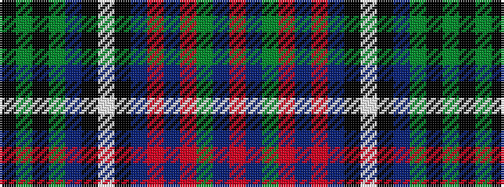

KGKGBKWKBRBRGBR

It is a 15 stripe tartan.

<figure class="pat-woven">

<figcaption>idealised sample</figcaption>
</figure>

## Colour Sequence



## Tartans with this colour sequence

| Tartans |
|---------------|
| [Mars Exploration](/setts/s15/r23db1g1r3db2r1db12k3w6k6db4g2k2g3k2~x2/)|
||
