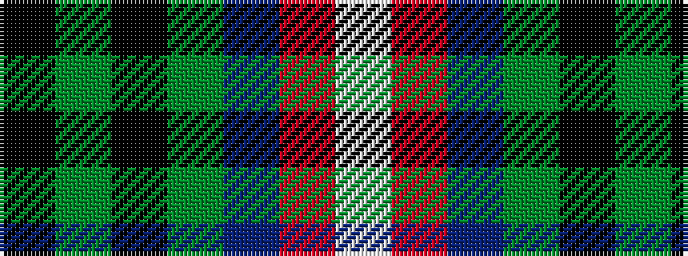

KGKGBRW

It is a 7 stripe tartan.

<figure class="pat-woven">

<figcaption>idealised sample</figcaption>
</figure>

## Colour Sequence



## Tartans with this colour sequence

| Tartans |
|---------------|
| [Disciples of Christ Motorcycle Ministry (Switzerland)](/variants/s7/k22g21k5g12t12o3w4~x2/)|
||
