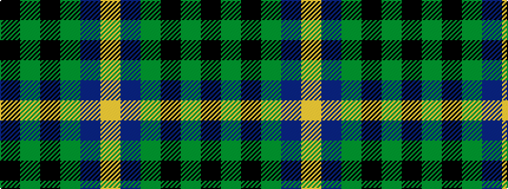

KGKGBY

It is a 6 stripe tartan.

<figure class="pat-woven">

<figcaption>idealised sample</figcaption>
</figure>

## Colour Sequence



## Tartans with this colour sequence

| Tartans |
|---------------|
| [Glenturret](/variants/s6/k3g14k14g2db15ly2~x2/)|
||
| [Glenturret Distillery](/variants/s6/lo4db24g3k21g23k1~x2/)|
||
