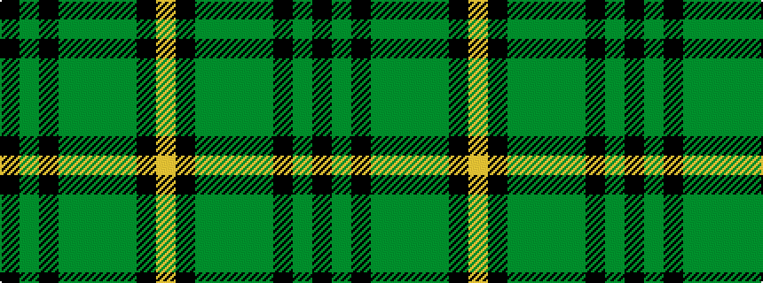

KGKGGGGKY

It is a 9 stripe tartan.

<figure class="pat-woven">

<figcaption>idealised sample</figcaption>
</figure>

## Colour Sequence



## Tartans with this colour sequence

| Tartans |
|---------------|
| [Leinster Ancestry (Fashion)](/variants/s9/k4dg33k18dy10g19dy3dg15k1lo3~x2/)|
||
