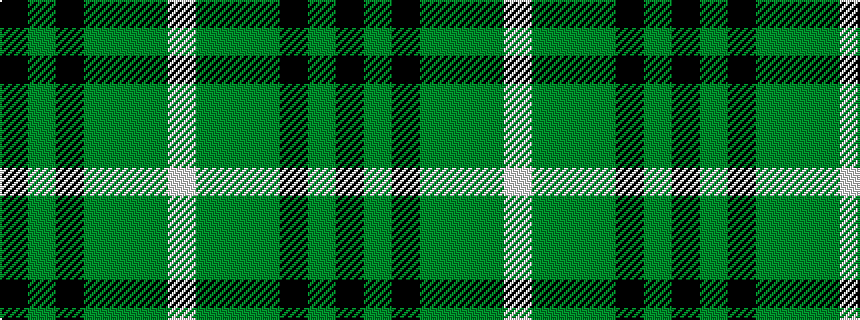

KGKGGGW

It is a 7 stripe tartan.

<figure class="pat-woven">

<figcaption>idealised sample</figcaption>
</figure>

## Colour Sequence



## Tartans with this colour sequence

| Tartans |
|---------------|
| [Ramsay Hunting Family Tartan](/variants/s7/k4dy9k13g6dy3g9w4~x2/)|
||
