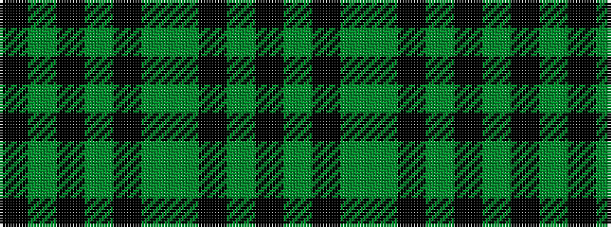

KGKGGKGKGK

It is a 10 stripe tartan.

<figure class="pat-woven">

<figcaption>idealised sample</figcaption>
</figure>

## Colour Sequence



## Tartans with this colour sequence

| Tartans |
|---------------|
| [Bute Heather, Black](/variants/s10/k6y20k6y4k4y8y2k8y2k5~x2/)|
||
