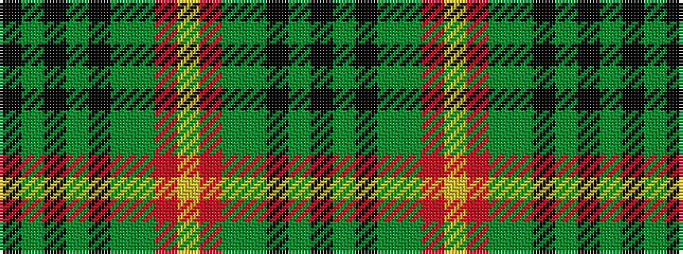

KGKGGRYRGGKGKGK

It is a 15 stripe tartan.

<figure class="pat-woven">

<figcaption>idealised sample</figcaption>
</figure>

## Colour Sequence



## Tartans with this colour sequence

| Tartans |
|---------------|
| [Lander (2013)](/setts/s15/k18dy3k3dy3k3dy16dg16r1ly1r1dg16dy16k17dy3k3~x2/)|
||
