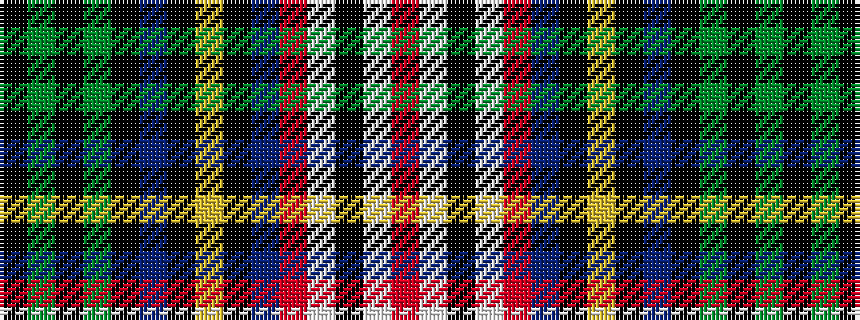

KGKGKBKYKBRWKWR

It is a 15 stripe tartan.

<figure class="pat-woven">

<figcaption>idealised sample</figcaption>
</figure>

## Colour Sequence



## Tartans with this colour sequence

| Tartans |
|---------------|
| [Coigach](/setts/s15/r3lb3k3lb3r3db8k1ly2k1db8k2g30k1g10k2~x2/)|
||
