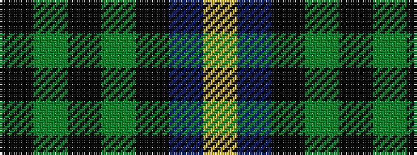

KGKGKBY

It is a 7 stripe tartan.

<figure class="pat-woven">

<figcaption>idealised sample</figcaption>
</figure>

## Colour Sequence



## Tartans with this colour sequence

| Tartans |
|---------------|
| [Unidentified No 39](/variants/s7/k4dg4k1dg4k4db4ly1~x2/)|
||
| [Unnamed, No 39](/variants/s7/k4g4k1g4k4db4ly1~x2/)|
||
