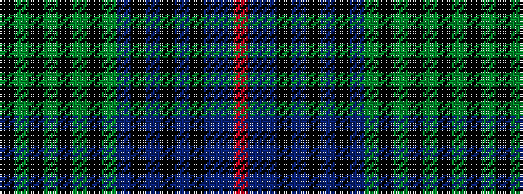

KGKGKGKGBKBKBKBBR

It is a 17 stripe tartan.

<figure class="pat-woven">

<figcaption>idealised sample</figcaption>
</figure>

## Colour Sequence



## Tartans with this colour sequence

| Tartans |
|---------------|
| [Rendell, Charles](/setts/s17/k2dg2k1dg2k1dg2k1dg12dt4k3dt3k3dt3k3dt4dp24r2~x2/)|
||
