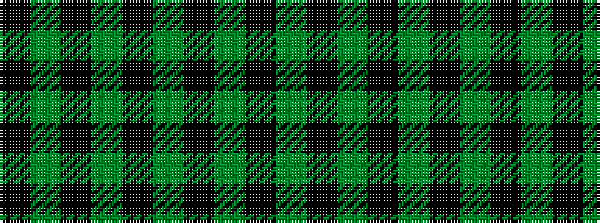

KGKGKGKGK

It is a 9 stripe tartan.

<figure class="pat-woven">

<figcaption>idealised sample</figcaption>
</figure>

## Colour Sequence



## Tartans with this colour sequence

| Tartans |
|---------------|
| [Glen Carron (Fashion)](/variants/s9/k1y12k2g1k2g3k1y1k1~x4/)|
||
