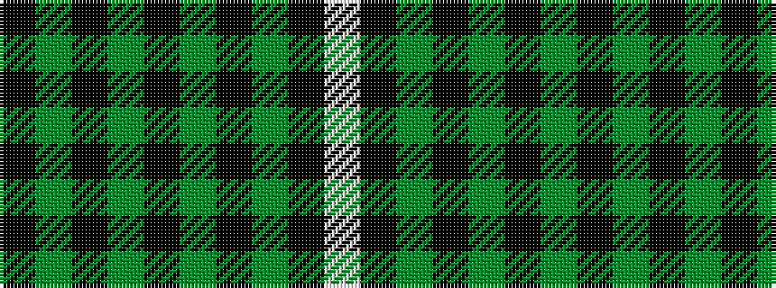

KGKGKGKGKW

It is a 10 stripe tartan.

<figure class="pat-woven">

<figcaption>idealised sample</figcaption>
</figure>

## Colour Sequence



## Tartans with this colour sequence

| Tartans |
|---------------|
| [Childers](/setts/s10/k4g13k4g8k44g8k4g13k4w3~x2/)|
||
