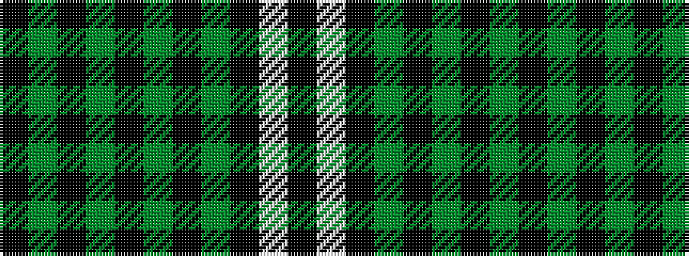

KGKGKGKGKWK

It is a 11 stripe tartan.

<figure class="pat-woven">

<figcaption>idealised sample</figcaption>
</figure>

## Colour Sequence



## Tartans with this colour sequence

| Tartans |
|---------------|
| [Stewart Mourning](/variants/s11/k68y11k16y4k4y4k4y19k14w4k14/)|
||
