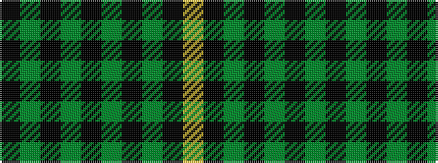

KGKGKGKGKY

It is a 10 stripe tartan.

<figure class="pat-woven">

<figcaption>idealised sample</figcaption>
</figure>

## Colour Sequence



## Tartans with this colour sequence

| Tartans |
|---------------|
| [Reagan (Personal)](/variants/s10/k4g12k3g4k3g3k36g3k2ly3~x2/)|
||
