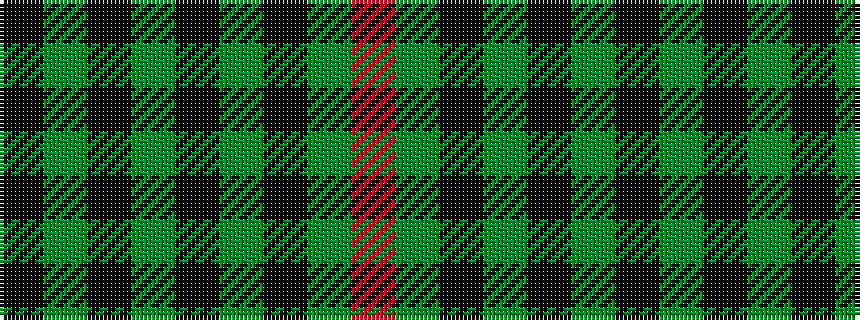

KGKGKGKGR

It is a 9 stripe tartan.

<figure class="pat-woven">

<figcaption>idealised sample</figcaption>
</figure>

## Colour Sequence



## Tartans with this colour sequence

| Tartans |
|---------------|
| [Urquhart](/setts/s9/r3g6k1g1k1g1k6g9k2~x2/)|
||
