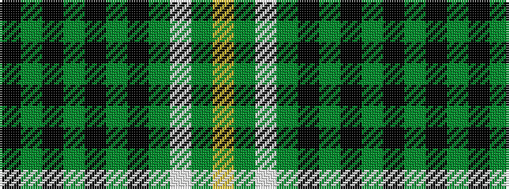

KGKGKGKGWGY

It is a 11 stripe tartan.

<figure class="pat-woven">

<figcaption>idealised sample</figcaption>
</figure>

## Colour Sequence



## Tartans with this colour sequence

| Tartans |
|---------------|
| [Malone (2016)](/setts/s11/k8dg1k20dg1k4dg1k3dg4w2dg24lo3~x2/)|
||
