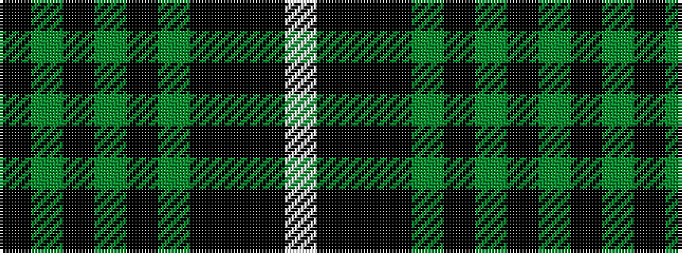

KGKGKGKKKW

It is a 10 stripe tartan.

<figure class="pat-woven">

<figcaption>idealised sample</figcaption>
</figure>

## Colour Sequence



## Tartans with this colour sequence

| Tartans |
|---------------|
| [Stewart of Bute Hunting Clan/Family Tartan Tartan Number: 5175. Earliest known date: 01/01/2002 No details known. See products available Copyright © Blair Urquhart, Comrie, 2015](/setts/s10/k22g11ki2g4ki2g6ki16k40k2lb6~x2/)|
||
