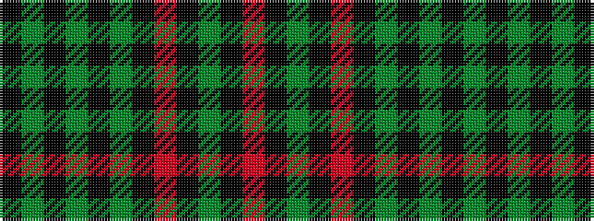

KGKGKGKRKGKR

It is a 12 stripe tartan.

<figure class="pat-woven">

<figcaption>idealised sample</figcaption>
</figure>

## Colour Sequence



## Tartans with this colour sequence

| Tartans |
|---------------|
| [Pope (Welsh Name)](/setts/s12/k10y26k2y4k2y26k3r36k3g30k3r2/)|
||
