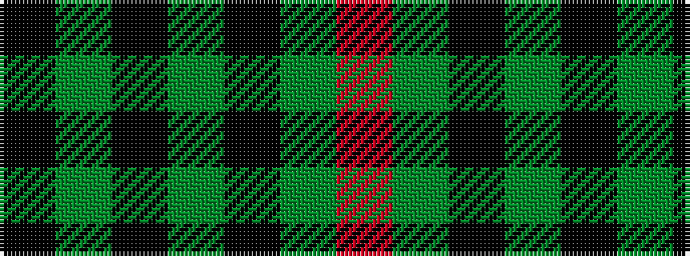

KGKGKGR

It is a 7 stripe tartan.

<figure class="pat-woven">

<figcaption>idealised sample</figcaption>
</figure>

## Colour Sequence



## Tartans with this colour sequence

| Tartans |
|---------------|
| [Moffat](/setts/s7/k39y3k3y3k14y28r3~x2/)|
||
