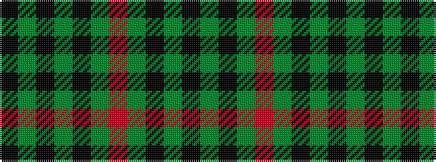

KGKGKGRGKGK

It is a 11 stripe tartan.

<figure class="pat-woven">

<figcaption>idealised sample</figcaption>
</figure>

## Colour Sequence



## Tartans with this colour sequence

| Tartans |
|---------------|
| [Madoc (Welsh Name)](/setts/s11/k3dg3k2dg4r2dg6k6dg4k4dg36k2/)|
||
