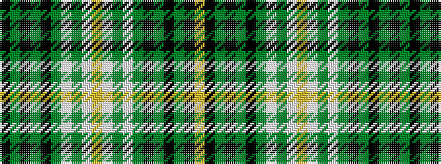

KGKGKGWGWYWGWGKGKGKY

It is a 20 stripe tartan.

<figure class="pat-woven">

<figcaption>idealised sample</figcaption>
</figure>

## Colour Sequence



## Tartans with this colour sequence

| Tartans |
|---------------|
| [Chartered Institute of Bankers](/setts/s20/k34y5k5y8k5y56lb5y5lb36ly5lb36y5lb5y56k5y8k5y5k34ly5/)|
||
