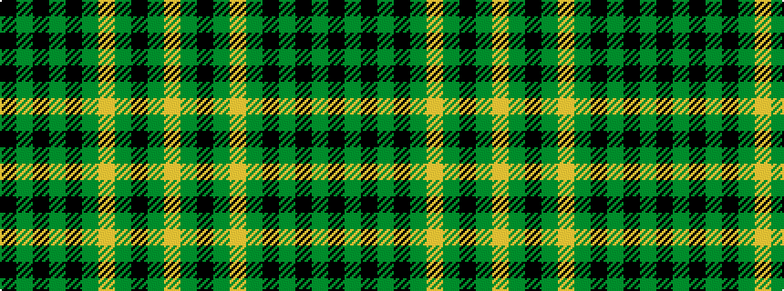

KGKGKGYGKGY

It is a 11 stripe tartan.

<figure class="pat-woven">

<figcaption>idealised sample</figcaption>
</figure>

## Colour Sequence



## Tartans with this colour sequence

| Tartans |
|---------------|
| [American Monahan (Personal)](/variants/s11/k13g3k4g3k3g19lo1g19k3g2lo4~x2/)|
||
