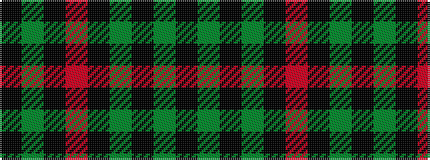

KGKGKRKGK

It is a 9 stripe tartan.

<figure class="pat-woven">

<figcaption>idealised sample</figcaption>
</figure>

## Colour Sequence



## Tartans with this colour sequence

| Tartans |
|---------------|
| [Lindsay (Crimson version) (Clan?)](/variants/s9/k12g1k1g1k1r5k10g1k2~x4/)|
||
