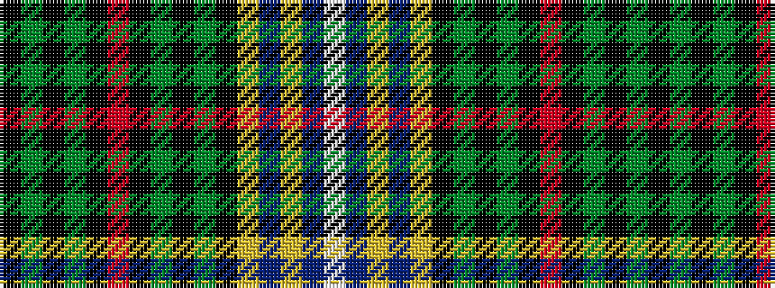

KGKGKRKGKGKYBYBW

It is a 16 stripe tartan.

<figure class="pat-woven">

<figcaption>idealised sample</figcaption>
</figure>

## Colour Sequence



## Tartans with this colour sequence

| Tartans |
|---------------|
| [Kungsholmen Snooker](/setts/s16/k13dy1k1g1k1r2k1g1k1dy1k13lr1t13ly2t1w4~x4/)|
||
