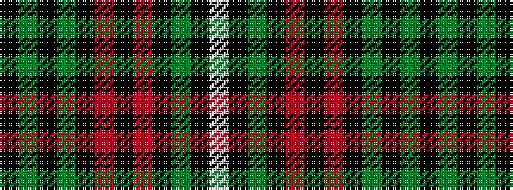

KGKGKRKRKGKW

It is a 12 stripe tartan.

<figure class="pat-woven">

<figcaption>idealised sample</figcaption>
</figure>

## Colour Sequence



## Tartans with this colour sequence

| Tartans |
|---------------|
| [Auld Lang Syne Brown Tartan Tartan Number: 2401. Earliest known date: Threadcount and colours aren't 100% original. Generated manually. See products available Copyright © Blair Urquhart, Comrie, 2015](/setts/s12/w4k2dy8k2o2k2o2k23dy10k2dy7k2~x2/)|
||
