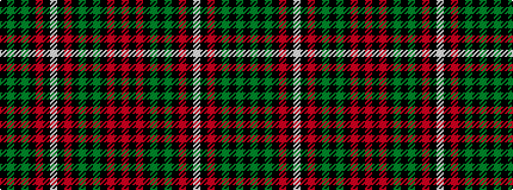

KGKGKRKWKRKGKGKRKR

It is a 18 stripe tartan.

<figure class="pat-woven">

<figcaption>idealised sample</figcaption>
</figure>

## Colour Sequence



## Tartans with this colour sequence

| Tartans |
|---------------|
| [Chapman (Personal)](/variants/s18/k36dg2k2dg2k18m18k3w3k3m18k18dg2k2dg2k18m18k3r3~x2/)|
||
