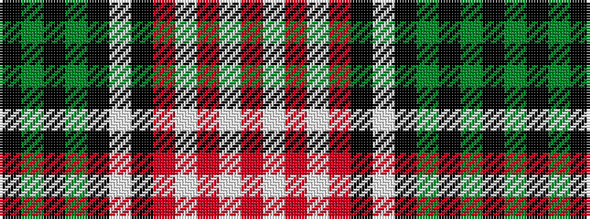

KGKGKWKRWRWR

It is a 12 stripe tartan.

<figure class="pat-woven">

<figcaption>idealised sample</figcaption>
</figure>

## Colour Sequence



## Tartans with this colour sequence

| Tartans |
|---------------|
| [Hayama Shirt Honten, The](/setts/s12/k4g4k2g12k6w3k6o2w4o2w15r3~x2/)|
||
