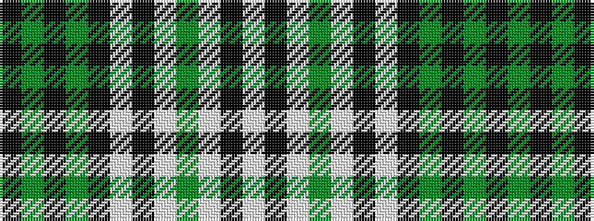

KGKGKWKWGWKW

It is a 12 stripe tartan.

<figure class="pat-woven">

<figcaption>idealised sample</figcaption>
</figure>

## Colour Sequence



## Tartans with this colour sequence

| Tartans |
|---------------|
| [Clergy #3](/setts/s12/k10y5k2y5k10w1k26w1y4w1k5w1~x2/)|
||
